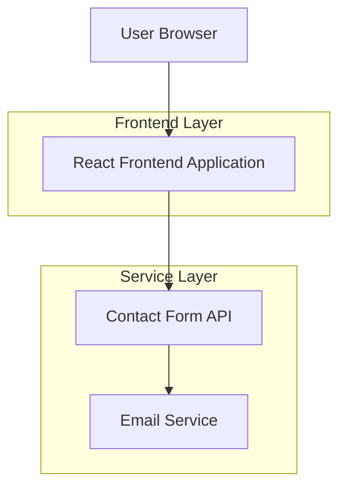

## 1.Architecture design



## 2.Technology Description
- Frontend: React@18 + tailwindcss@3 + vite
- Initialization Tool: vite-init
- Backend: None (static site with form handling)
- Contact Form: Netlify Forms or Formspree integration

## 3.Route definitions
| Route | Purpose |
|-------|---------|
| / | Landing page with hero section and services overview |
| /about | About Us page with company information and team details |
| /projects | Projects page showcasing completed plumbing work |
| /contact | Contact page with form and contact details |

## 4.API definitions
### 4.1 Contact Form API

Contact form submission
```
POST /api/contact
```

Request:
| Param Name| Param Type  | isRequired  | Description |
|-----------|-------------|-------------|-------------|
| name      | string      | true        | Visitor's full name |
| email     | string      | true        | Visitor's email address |
| phone     | string      | false       | Visitor's phone number |
| service   | string      | true        | Type of service requested |
| message   | string      | true        | Detailed message from visitor |

Response:
| Param Name| Param Type  | Description |
|-----------|-------------|-------------|
| success   | boolean     | Form submission status |
| message   | string      | Success/error message |

Example
```json
{
  "name": "John Smith",
  "email": "john@example.com",
  "phone": "0652191154",
  "service": "Emergency Plumbing",
  "message": "Burst pipe in kitchen, need immediate assistance"
}
```