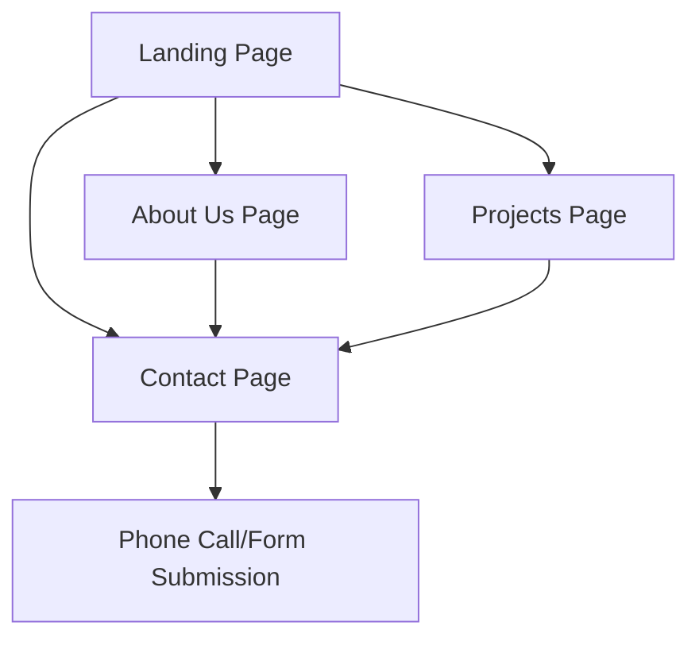

## 1. Product Overview
Mount Edgecombe Plumbing and Holdings website showcasing professional plumbing services and company information. The website serves as a digital presence for the company to attract potential clients and showcase their expertise.
- Target audience: Residential and commercial clients seeking plumbing services in Mount Edgecombe area
- Market value: Professional service company website to build trust and generate leads

## 2. Core Features

### 2.1 User Roles
| Role | Registration Method | Core Permissions |
|------|---------------------|------------------|
| Website Visitor | No registration required | Browse all pages, view contact information, submit contact forms |

### 2.2 Feature Module
Our Mount Edgecombe Plumbing and Holdings website consists of the following main pages:
1. **Landing page**: Hero section, services overview, contact call-to-action, company introduction.
2. **About Us page**: Company history, team information, mission statement, certifications.
3. **Projects page**: Portfolio showcase, project galleries, service categories.
4. **Contact page**: Contact form, contact details, business hours, location information.

### 2.3 Page Details
| Page Name | Module Name | Feature description |
|-----------|-------------|---------------------|
| Landing page | Hero section | Display company name with professional plumbing imagery, contact numbers prominently displayed, call-to-action buttons for services and contact. |
| Landing page | Services overview | Showcase main plumbing services offered with icons and brief descriptions, link to projects page for detailed examples. |
| Landing page | Company introduction | Brief company description highlighting expertise and local presence in Mount Edgecombe area. |
| About Us page | Company history | Present company background, years of experience, and growth story in professional format. |
| About Us page | Team information | Display team members with photos, qualifications, and expertise areas. |
| About Us page | Certifications | Show professional certifications, licenses, and industry memberships. |
| Projects page | Portfolio gallery | Display completed plumbing projects with before/after photos, project descriptions, and service categories. |
| Projects page | Service categories | Organize projects by service type (residential, commercial, emergency, etc.). |
| Contact page | Contact form | Allow visitors to submit inquiries with name, email, phone, service type, and message fields. |
| Contact page | Contact details | Display both phone numbers (0652191154 and 0670090178), email address, and business address. |
| Contact page | Business hours | Show operating hours and emergency service availability. |

## 3. Core Process
**Visitor Flow**: User lands on homepage → Views services overview → Explores projects portfolio → Reads about company → Submits contact form or calls directly.

## 4. User Interface Design
### 4.1 Design Style
- **Primary colors**: White (#FFFFFF), Blue (#0066CC), Teal (#20B2AA)
- **Button style**: Rounded corners with hover effects, primary buttons in teal, secondary in blue
- **Font**: Professional sans-serif (Roboto or similar), headings 24-32px, body text 16px
- **Layout style**: Clean card-based design with generous white space, top navigation bar
- **Icons**: Professional line icons for services, tool/equipment themed emojis

### 4.2 Page Design Overview
| Page Name | Module Name | UI Elements |
|-----------|-------------|-------------|
| Landing page | Hero section | Full-width hero banner with plumbing imagery overlay, company name in large white text, contact numbers in teal call-to-action boxes, navigation bar with white background and teal accents. |
| Landing page | Services overview | Three-column card layout with service icons, blue headers, white background cards with subtle shadow effects. |
| About Us page | Company history | Timeline design with alternating left/right content blocks, blue accent lines, professional imagery. |
| Projects page | Portfolio gallery | Masonry grid layout with hover effects, blue borders, lightbox functionality for image viewing. |
| Contact page | Contact form | Two-column layout with form on left (white background), contact details on right (teal background), embedded map placeholder. |

### 4.3 Responsiveness
Desktop-first design approach with mobile responsiveness. Navigation collapses to hamburger menu on mobile, cards stack vertically, contact form becomes single column on smaller screens.